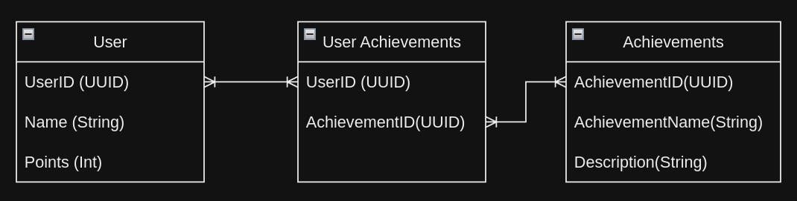

## Online-roulette-simulation - Project readme/docs

### 1. Functional Requirements:

- user is able to bet points on different colours.
- user is able to win points depending on colour multiplier.
- user is able to loose points depending on colour if picked incorrectly.
- user is able to receive achievments after certain actions.
- user is given position in the ranking based on points.
- user is able to browse history of games.

### 2. App technology:

- Frontend: React
- Backend: Spring Boot
- Database: PostgreSQL (Docker)

### 3. Database schema: 

### 4. App architecture: 

### 5. Development: 

